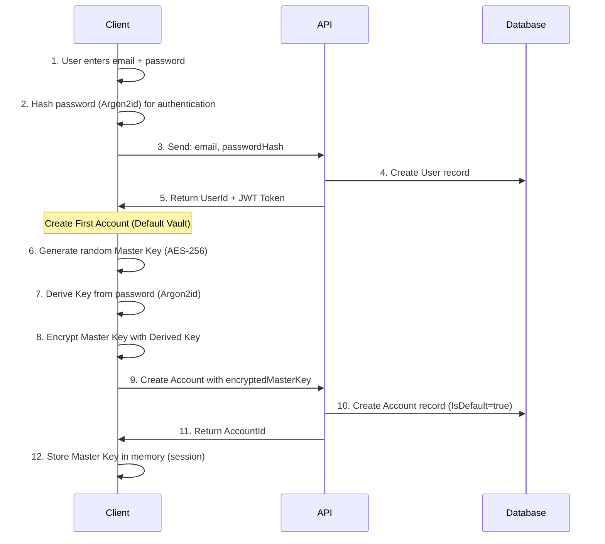
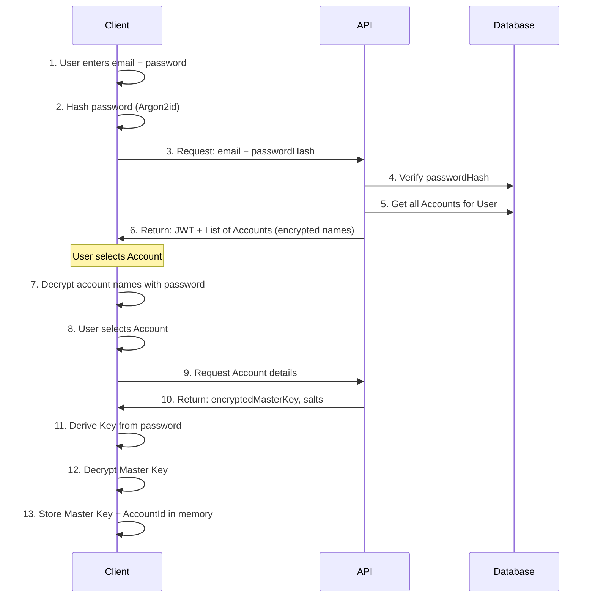
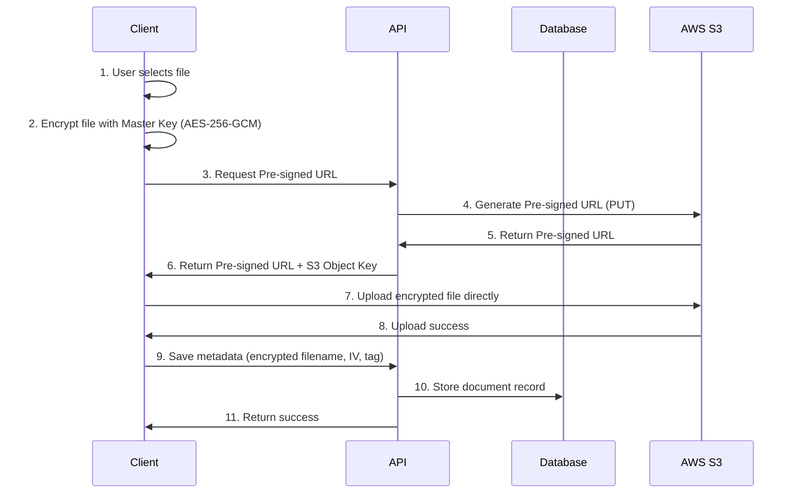
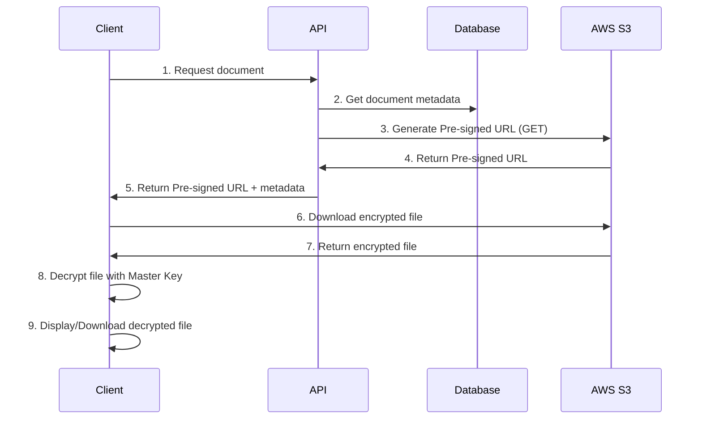
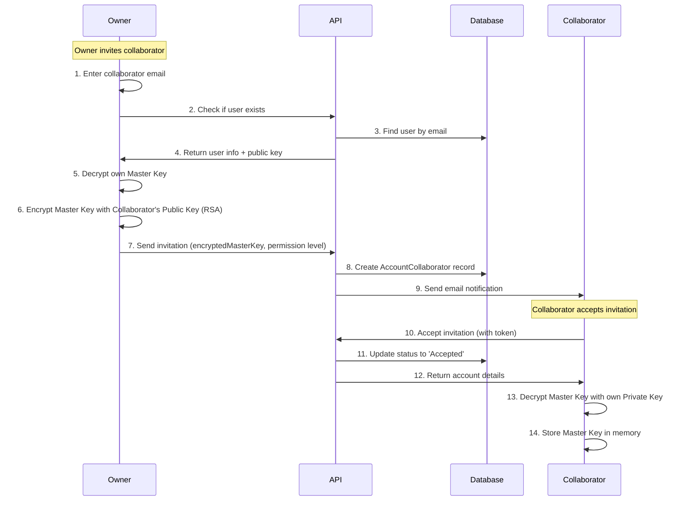

# Backend Architecture Design - DigitalVault

## ภาพรวมระบบ

ระบบ DigitalVault ใช้หลักการ **Zero-Knowledge Encryption** โดยข้อมูลทั้งหมดจะถูกเข้ารหัสที่ฝั่ง Client ก่อนส่งไปเก็บที่ Server และ AWS S3

## หลักการสำคัญ

> [!IMPORTANT]
> - **เจ้าของ Account เท่านั้น** ที่สามารถ Login และดูข้อมูลได้
> - **สมาชิกครอบครัว** เป็นเพียงข้อมูลที่เก็บไว้ ไม่สามารถ Login ได้
> - **ข้อมูลทั้งหมด** ถูกเข้ารหัสด้วย Master Key ของเจ้าของ Account
> - **เอกสาร** เก็บบน AWS S3 โดยใช้ Pre-signed URLs
> - **Server ไม่สามารถอ่านข้อมูล** ที่ถูกเข้ารหัสได้

---

## 1. Database Schema

### 1.1 Users Table (ผู้ใช้งาน - สามารถมีหลายบัญชีได้)

```sql
CREATE TABLE Users (
    UserId UNIQUEIDENTIFIER PRIMARY KEY DEFAULT NEWID(),
    Email NVARCHAR(255) NOT NULL UNIQUE,
    PhoneNumber NVARCHAR(50) NULL,
    
    -- Authentication (ไม่เกี่ยวกับ encryption)
    PasswordHash NVARCHAR(512) NOT NULL,          -- Argon2id hash for login
    PasswordSalt NVARCHAR(256) NOT NULL,
    
    -- Account Info
    CreatedAt DATETIME2 NOT NULL DEFAULT GETUTCDATE(),
    LastLoginAt DATETIME2 NULL,
    IsActive BIT NOT NULL DEFAULT 1,
    
    INDEX IX_Users_Email (Email)
);
```

### 1.2 Accounts Table (บัญชี/Vault - User สามารถมีได้หลายบัญชี)

```sql
CREATE TABLE Accounts (
    AccountId UNIQUEIDENTIFIER PRIMARY KEY DEFAULT NEWID(),
    UserId UNIQUEIDENTIFIER NOT NULL,
    
    -- Encrypted Account Name
    EncryptedAccountName NVARCHAR(512) NOT NULL,
    
    -- Zero-Knowledge Encryption Fields (แยกต่างหากสำหรับแต่ละ Account)
    EncryptedMasterKey NVARCHAR(1024) NOT NULL,   -- Master key encrypted with password-derived key
    MasterKeySalt NVARCHAR(256) NOT NULL,         -- Salt for key derivation (unique per account)
    AuthenticationTag NVARCHAR(256) NOT NULL,     -- For verifying decryption
    
    -- Account Settings
    IsDefault BIT NOT NULL DEFAULT 0,             -- Default account for user
    
    CreatedAt DATETIME2 NOT NULL DEFAULT GETUTCDATE(),
    UpdatedAt DATETIME2 NOT NULL DEFAULT GETUTCDATE(),
    
    FOREIGN KEY (UserId) REFERENCES Users(UserId) ON DELETE CASCADE,
    INDEX IX_Accounts_UserId (UserId)
);
```

### 1.3 FamilyMembers Table (สมาชิกครอบครัว - ไม่มี UserId)

```sql
CREATE TABLE FamilyMembers (
    FamilyMemberId UNIQUEIDENTIFIER PRIMARY KEY DEFAULT NEWID(),
    AccountId UNIQUEIDENTIFIER NOT NULL,          -- เปลี่ยนจาก UserId เป็น AccountId
    
    -- Encrypted Data (encrypted with Account's Master Key)
    EncryptedFirstName NVARCHAR(512) NOT NULL,
    EncryptedLastName NVARCHAR(512) NOT NULL,
    EncryptedRelationship NVARCHAR(512) NULL,
    EncryptedDateOfBirth NVARCHAR(512) NULL,
    EncryptedPhoneNumber NVARCHAR(512) NULL,
    EncryptedEmail NVARCHAR(512) NULL,
    EncryptedNotes NVARCHAR(MAX) NULL,
    
    -- Metadata (not encrypted - for UI display only)
    AvatarColor NVARCHAR(20) NULL,              -- สีพื้นหลัง avatar
    InitialsPlainText NVARCHAR(10) NULL,        -- ตัวอักษรย่อสำหรับแสดง (ไม่เข้ารหัส)
    
    CreatedAt DATETIME2 NOT NULL DEFAULT GETUTCDATE(),
    UpdatedAt DATETIME2 NOT NULL DEFAULT GETUTCDATE(),
    
    FOREIGN KEY (AccountId) REFERENCES Accounts(AccountId) ON DELETE CASCADE,
    INDEX IX_FamilyMembers_AccountId (AccountId)
);
```

### 1.4 Documents Table (เอกสาร)

```sql
CREATE TABLE Documents (
    DocumentId UNIQUEIDENTIFIER PRIMARY KEY DEFAULT NEWID(),
    FamilyMemberId UNIQUEIDENTIFIER NOT NULL,
    AccountId UNIQUEIDENTIFIER NOT NULL,          -- เพิ่ม AccountId
    
    -- Document Type
    DocumentType NVARCHAR(50) NOT NULL,  -- 'IdCard', 'DriverLicense', 'Passport', 'HouseRegistration', 'BirthCertificate'
    
    -- AWS S3 Info
    S3BucketName NVARCHAR(255) NOT NULL,
    S3ObjectKey NVARCHAR(512) NOT NULL,  -- Format: accounts/{accountId}/documents/{documentId}.enc
    S3Region NVARCHAR(50) NOT NULL,
    
    -- Encrypted Metadata
    EncryptedOriginalFileName NVARCHAR(512) NOT NULL,
    EncryptedFileExtension NVARCHAR(128) NOT NULL,
    EncryptedFileSize NVARCHAR(128) NOT NULL,
    EncryptedMimeType NVARCHAR(256) NOT NULL,
    
    -- Encryption Info (unique per file)
    EncryptionIV NVARCHAR(256) NOT NULL,         -- Initialization Vector
    EncryptionTag NVARCHAR(256) NOT NULL,        -- Authentication Tag (GCM)
    
    -- Timestamps
    UploadedAt DATETIME2 NOT NULL DEFAULT GETUTCDATE(),
    UpdatedAt DATETIME2 NOT NULL DEFAULT GETUTCDATE(),
    
    FOREIGN KEY (FamilyMemberId) REFERENCES FamilyMembers(FamilyMemberId) ON DELETE CASCADE,
    FOREIGN KEY (AccountId) REFERENCES Accounts(AccountId) ON DELETE NO ACTION,
    INDEX IX_Documents_FamilyMemberId (FamilyMemberId),
    INDEX IX_Documents_AccountId (AccountId),
    INDEX IX_Documents_DocumentType (DocumentType)
);
```

### 1.5 DocumentMetadata Table (ข้อมูลเอกสาร - เช่น เลขบัตร, วันหมดอายุ)

```sql
CREATE TABLE DocumentMetadata (
    MetadataId UNIQUEIDENTIFIER PRIMARY KEY DEFAULT NEWID(),
    DocumentId UNIQUEIDENTIFIER NOT NULL,
    
    -- Encrypted Fields (e.g., "IdCardNumber", "ExpiryDate", "IssuedDate", "IssuedProvince")
    EncryptedFieldName NVARCHAR(256) NOT NULL,    -- ชื่อฟิลด์ (เข้ารหัส)
    EncryptedFieldValue NVARCHAR(MAX) NOT NULL,   -- ค่าของฟิลด์ (เข้ารหัส)
    
    CreatedAt DATETIME2 NOT NULL DEFAULT GETUTCDATE(),
    UpdatedAt DATETIME2 NOT NULL DEFAULT GETUTCDATE(),
    
    FOREIGN KEY (DocumentId) REFERENCES Documents(DocumentId) ON DELETE CASCADE,
    INDEX IX_DocumentMetadata_DocumentId (DocumentId)
);
```

### 1.6 FileAttachments Table (ไฟล์แนบอื่นๆ)

```sql
CREATE TABLE FileAttachments (
    FileId UNIQUEIDENTIFIER PRIMARY KEY DEFAULT NEWID(),
    FamilyMemberId UNIQUEIDENTIFIER NOT NULL,
    AccountId UNIQUEIDENTIFIER NOT NULL,
    
    -- AWS S3 Info
    S3BucketName NVARCHAR(255) NOT NULL,
    S3ObjectKey NVARCHAR(512) NOT NULL,  -- Format: accounts/{accountId}/files/{fileId}.enc
    S3Region NVARCHAR(50) NOT NULL,
    
    -- Encrypted Metadata
    EncryptedFileName NVARCHAR(512) NOT NULL,
    EncryptedFileExtension NVARCHAR(128) NOT NULL,
    EncryptedFileSize NVARCHAR(128) NOT NULL,
    EncryptedMimeType NVARCHAR(256) NOT NULL,
    EncryptedDescription NVARCHAR(MAX) NULL,
    
    -- Encryption Info
    EncryptionIV NVARCHAR(256) NOT NULL,
    EncryptionTag NVARCHAR(256) NOT NULL,
    
    -- Folder Organization
    EncryptedFolderPath NVARCHAR(1024) NULL,
    
    UploadedAt DATETIME2 NOT NULL DEFAULT GETUTCDATE(),
    
    FOREIGN KEY (FamilyMemberId) REFERENCES FamilyMembers(FamilyMemberId) ON DELETE CASCADE,
    FOREIGN KEY (AccountId) REFERENCES Accounts(AccountId) ON DELETE NO ACTION,
    INDEX IX_FileAttachments_FamilyMemberId (FamilyMemberId),
    INDEX IX_FileAttachments_AccountId (AccountId)
);
```

### 1.7 Notes Table (บันทึกช่วยจำ)

```sql
CREATE TABLE Notes (
    NoteId UNIQUEIDENTIFIER PRIMARY KEY DEFAULT NEWID(),
    FamilyMemberId UNIQUEIDENTIFIER NOT NULL,
    AccountId UNIQUEIDENTIFIER NOT NULL,
    
    -- Encrypted Content
    EncryptedTitle NVARCHAR(512) NULL,
    EncryptedContent NVARCHAR(MAX) NOT NULL,
    
    CreatedAt DATETIME2 NOT NULL DEFAULT GETUTCDATE(),
    UpdatedAt DATETIME2 NOT NULL DEFAULT GETUTCDATE(),
    
    FOREIGN KEY (FamilyMemberId) REFERENCES FamilyMembers(FamilyMemberId) ON DELETE CASCADE,
    FOREIGN KEY (AccountId) REFERENCES Accounts(AccountId) ON DELETE NO ACTION,
    INDEX IX_Notes_FamilyMemberId (FamilyMemberId),
    INDEX IX_Notes_AccountId (AccountId)
);
```

### 1.8 AccountCollaborators Table (ผู้ร่วมงาน/Shared Access)

```sql
CREATE TABLE AccountCollaborators (
    CollaboratorId UNIQUEIDENTIFIER PRIMARY KEY DEFAULT NEWID(),
    AccountId UNIQUEIDENTIFIER NOT NULL,
    UserId UNIQUEIDENTIFIER NOT NULL,              -- User ที่ถูกเชิญ
    InvitedByUserId UNIQUEIDENTIFIER NOT NULL,     -- User ที่เชิญ
    
    -- Permission Level
    PermissionLevel NVARCHAR(20) NOT NULL,         -- 'Viewer', 'Editor', 'Admin'
    
    -- Encrypted Master Key (สำหรับ Collaborator)
    -- Master Key ของ Account ถูกเข้ารหัสด้วย Public Key ของ Collaborator
    EncryptedMasterKeyForCollaborator NVARCHAR(2048) NOT NULL,
    
    -- Invitation Status
    InvitationStatus NVARCHAR(20) NOT NULL DEFAULT 'Pending',  -- 'Pending', 'Accepted', 'Declined'
    InvitationToken NVARCHAR(256) NULL,            -- Token สำหรับยืนยันการเชิญ
    InvitationExpiresAt DATETIME2 NULL,
    
    -- Timestamps
    InvitedAt DATETIME2 NOT NULL DEFAULT GETUTCDATE(),
    AcceptedAt DATETIME2 NULL,
    LastAccessedAt DATETIME2 NULL,
    
    -- Status
    IsActive BIT NOT NULL DEFAULT 1,
    RevokedAt DATETIME2 NULL,
    RevokedByUserId UNIQUEIDENTIFIER NULL,
    
    FOREIGN KEY (AccountId) REFERENCES Accounts(AccountId) ON DELETE CASCADE,
    FOREIGN KEY (UserId) REFERENCES Users(UserId) ON DELETE NO ACTION,
    FOREIGN KEY (InvitedByUserId) REFERENCES Users(UserId) ON DELETE NO ACTION,
    FOREIGN KEY (RevokedByUserId) REFERENCES Users(UserId) ON DELETE NO ACTION,
    
    INDEX IX_AccountCollaborators_AccountId (AccountId),
    INDEX IX_AccountCollaborators_UserId (UserId),
    INDEX IX_AccountCollaborators_InvitationToken (InvitationToken),
    
    -- Unique constraint: User can only be collaborator once per account
    UNIQUE (AccountId, UserId)
);
```

### 1.9 UserKeyPairs Table (Public/Private Keys สำหรับ Sharing)

```sql
CREATE TABLE UserKeyPairs (
    KeyPairId UNIQUEIDENTIFIER PRIMARY KEY DEFAULT NEWID(),
    UserId UNIQUEIDENTIFIER NOT NULL,
    
    -- RSA Key Pair (สำหรับเข้ารหัส Master Key เพื่อแชร์)
    PublicKey NVARCHAR(MAX) NOT NULL,              -- RSA Public Key (PEM format)
    EncryptedPrivateKey NVARCHAR(MAX) NOT NULL,    -- RSA Private Key encrypted with user's password
    PrivateKeySalt NVARCHAR(256) NOT NULL,
    
    -- Key Info
    KeyAlgorithm NVARCHAR(50) NOT NULL DEFAULT 'RSA-4096',
    CreatedAt DATETIME2 NOT NULL DEFAULT GETUTCDATE(),
    IsActive BIT NOT NULL DEFAULT 1,
    
    FOREIGN KEY (UserId) REFERENCES Users(UserId) ON DELETE CASCADE,
    INDEX IX_UserKeyPairs_UserId (UserId)
);
```

### 1.10 AuditLogs Table (Activity Logs)

```sql
CREATE TABLE AuditLogs (
    LogId UNIQUEIDENTIFIER PRIMARY KEY DEFAULT NEWID(),
    AccountId UNIQUEIDENTIFIER NOT NULL,
    UserId UNIQUEIDENTIFIER NOT NULL,
    
    -- Action Info
    Action NVARCHAR(100) NOT NULL,                 -- 'ViewDocument', 'UploadDocument', 'DeleteDocument', 'InviteCollaborator', etc.
    ResourceType NVARCHAR(50) NULL,                -- 'Document', 'FamilyMember', 'Note', etc.
    ResourceId UNIQUEIDENTIFIER NULL,
    
    -- Encrypted Details (optional)
    EncryptedDetails NVARCHAR(MAX) NULL,
    
    -- Metadata
    IpAddress NVARCHAR(50) NULL,
    UserAgent NVARCHAR(512) NULL,
    
    CreatedAt DATETIME2 NOT NULL DEFAULT GETUTCDATE(),
    
    FOREIGN KEY (AccountId) REFERENCES Accounts(AccountId) ON DELETE CASCADE,
    FOREIGN KEY (UserId) REFERENCES Users(UserId) ON DELETE NO ACTION,
    
    INDEX IX_AuditLogs_AccountId (AccountId),
    INDEX IX_AuditLogs_UserId (UserId),
    INDEX IX_AuditLogs_CreatedAt (CreatedAt)
);
```

---

## 2. Zero-Knowledge Encryption Workflow

### 2.1 Registration Flow (สร้าง User + Account แรก)



**ขั้นตอนละเอียด:**

1. **Client hashes password for authentication:**
   ```javascript
   const authSalt = crypto.getRandomValues(new Uint8Array(16));
   const passwordHash = await argon2.hash(password, authSalt);
   ```

2. **Create User (API):**
   ```csharp
   var user = new User {
       Email = request.Email,
       PasswordHash = request.PasswordHash,
       PasswordSalt = request.PasswordSalt
   };
   await _userRepository.CreateAsync(user);
   ```

3. **Client generates Master Key for first Account:**
   ```javascript
   const masterKey = crypto.getRandomValues(new Uint8Array(32)); // 256-bit
   const masterKeySalt = crypto.getRandomValues(new Uint8Array(16));
   const derivedKey = await argon2.hash(password, masterKeySalt);
   const encryptedMasterKey = await AES-GCM.encrypt(masterKey, derivedKey);
   ```

4. **Create Account (API):**
   ```csharp
   var account = new Account {
       UserId = userId,
       EncryptedAccountName = request.EncryptedAccountName, // "My Vault"
       EncryptedMasterKey = request.EncryptedMasterKey,
       MasterKeySalt = request.MasterKeySalt,
       IsDefault = true
   };
   await _accountRepository.CreateAsync(account);
   ```

### 2.2 Login Flow (เลือก Account)



**Account Selection UI:**
```
┌─────────────────────────────────┐
│  Select Your Vault              │
├─────────────────────────────────┤
│  🏠 My Family Vault (Default)   │
│  💼 Business Documents          │
│  🏥 Medical Records             │
│  ➕ Create New Vault            │
└─────────────────────────────────┘
```

### 2.3 Document Upload Flow (AWS S3 Pre-signed URL)



### 2.4 Document Download Flow



### 2.5 Collaborator Invitation Flow (แชร์ Account)



**Permission Levels:**

| Level | View | Edit | Delete | Invite Others | Manage Permissions |
|-------|------|------|--------|---------------|-------------------|
| **Viewer** | ✅ | ❌ | ❌ | ❌ | ❌ |
| **Editor** | ✅ | ✅ | ✅ | ❌ | ❌ |
| **Admin** | ✅ | ✅ | ✅ | ✅ | ✅ |

**Key Sharing Process:**

1. **Owner has Master Key** (already decrypted in memory)
2. **Fetch Collaborator's Public Key** from database
3. **Encrypt Master Key** using RSA-4096 with Collaborator's Public Key
4. **Store encrypted Master Key** in `AccountCollaborators.EncryptedMasterKeyForCollaborator`
5. **Collaborator decrypts** using their own Private Key (encrypted with their password)

**Security Notes:**
- Master Key ไม่เคยส่งแบบ plain text
- ใช้ RSA-4096 สำหรับ asymmetric encryption
- Collaborator ต้องมี Private Key ที่ decrypt ด้วย password ของตัวเอง
- Invitation token มีอายุ 7 วัน

---

## 3. API Endpoints

### 3.1 Authentication

```
POST   /api/auth/register              # Create User + First Account
POST   /api/auth/login                 # Login + Get Accounts list
POST   /api/auth/logout
POST   /api/auth/refresh-token
GET    /api/auth/verify
```

### 3.2 Accounts Management

```
GET    /api/accounts                   # Get all accounts for current user
GET    /api/accounts/{accountId}       # Get specific account details
POST   /api/accounts                   # Create new account/vault
PUT    /api/accounts/{accountId}       # Update account name
DELETE /api/accounts/{accountId}       # Delete account (cascade delete all data)
POST   /api/accounts/{accountId}/select # Select active account for session
```

### 3.3 Family Members

```
GET    /api/accounts/{accountId}/family-members
GET    /api/family-members/{id}
POST   /api/accounts/{accountId}/family-members
PUT    /api/family-members/{id}
DELETE /api/family-members/{id}
```

### 3.4 Documents

```
GET    /api/family-members/{memberId}/documents
GET    /api/documents/{id}
POST   /api/documents/presigned-url/upload    # Get upload URL
POST   /api/documents                          # Save metadata after upload
GET    /api/documents/{id}/presigned-url      # Get download URL
PUT    /api/documents/{id}/metadata
DELETE /api/documents/{id}
```

### 3.5 Files

```
GET    /api/family-members/{memberId}/files
POST   /api/files/presigned-url/upload
POST   /api/files
GET    /api/files/{id}/presigned-url
DELETE /api/files/{id}
```

### 3.6 Notes

```
GET    /api/family-members/{memberId}/notes
POST   /api/notes
PUT    /api/notes/{id}
DELETE /api/notes/{id}
```

### 3.7 Collaborators & Sharing

```
GET    /api/accounts/{accountId}/collaborators          # Get all collaborators
POST   /api/accounts/{accountId}/collaborators/invite   # Invite collaborator
POST   /api/collaborators/{invitationToken}/accept      # Accept invitation
POST   /api/collaborators/{invitationToken}/decline     # Decline invitation
PUT    /api/collaborators/{collaboratorId}/permission   # Update permission level
DELETE /api/collaborators/{collaboratorId}              # Remove collaborator
GET    /api/collaborators/invitations                   # Get pending invitations for current user
```

### 3.8 Audit Logs

```
GET    /api/accounts/{accountId}/audit-logs             # Get activity logs
GET    /api/audit-logs/my-activity                      # Get current user's activity
```

---

## 4. AWS S3 Configuration

### 4.1 Bucket Structure

```
digital-vault-documents-{environment}/
├── accounts/
│   └── {accountId}/
│       ├── documents/
│       │   ├── {documentId}.enc
│       │   └── {documentId}_thumbnail.enc
│       └── files/
│           └── {fileId}.enc
```

**Naming Convention:**
- `{accountId}` = GUID ของ Account
- `{documentId}.enc` = ไฟล์เอกสารที่เข้ารหัสแล้ว
- `{fileId}.enc` = ไฟล์แนบที่เข้ารหัสแล้ว
- `.enc` extension = บ่งบอกว่าไฟล์ถูกเข้ารหัส

### 4.2 S3 Bucket Policy

```json
{
  "Version": "2012-10-17",
  "Statement": [
    {
      "Sid": "DenyUnencryptedObjectUploads",
      "Effect": "Deny",
      "Principal": "*",
      "Action": "s3:PutObject",
      "Resource": "arn:aws:s3:::digital-vault-documents-prod/*",
      "Condition": {
        "StringNotEquals": {
          "s3:x-amz-server-side-encryption": "AES256"
        }
      }
    }
  ]
}
```

### 4.3 Pre-signed URL Generation (C#)

```csharp
public async Task<string> GenerateUploadPresignedUrl(
    string userId, 
    string objectKey, 
    string contentType)
{
    var request = new GetPreSignedUrlRequest
    {
        BucketName = _bucketName,
        Key = $"users/{userId}/documents/{objectKey}",
        Verb = HttpVerb.PUT,
        Expires = DateTime.UtcNow.AddMinutes(15),
        ContentType = contentType,
        ServerSideEncryptionMethod = ServerSideEncryptionMethod.AES256
    };
    
    return await _s3Client.GetPreSignedURLAsync(request);
}
```

---

## 5. Security Considerations

### 5.1 Encryption Standards

- **Master Key:** AES-256-GCM
- **Password Hashing:** Argon2id
- **Key Derivation:** PBKDF2 or Argon2id
- **File Encryption:** AES-256-GCM with random IV per file
- **S3 Server-Side Encryption:** AES-256

### 5.2 Key Management

> [!CAUTION]
> - Master Key **ไม่เคย** ส่งไปที่ Server
> - Master Key เก็บใน **Memory เท่านั้น** (ไม่เก็บใน LocalStorage)
> - เมื่อ Logout หรือปิด Browser ต้องลบ Master Key ทันที
> - Session timeout: 30 นาที (ต้อง re-authenticate)

### 5.3 Access Control

```csharp
// Middleware to verify user owns the resource
public class ResourceOwnershipMiddleware
{
    public async Task InvokeAsync(HttpContext context)
    {
        var userId = context.User.FindFirst("UserId")?.Value;
        var resourceUserId = context.Request.RouteValues["userId"]?.ToString();
        
        if (userId != resourceUserId)
        {
            context.Response.StatusCode = 403;
            return;
        }
        
        await _next(context);
    }
}
```

---

## 6. Implementation Priority

### Phase 1: Core Authentication
- [ ] User registration with Zero-Knowledge encryption
- [ ] Login/Logout with Master Key derivation
- [ ] JWT token management

### Phase 2: Family Members
- [ ] CRUD operations for family members
- [ ] Client-side encryption/decryption

### Phase 3: AWS S3 Integration
- [ ] Pre-signed URL generation
- [ ] Document upload/download workflow
- [ ] S3 bucket configuration

### Phase 4: Document Management
- [ ] Document metadata storage
- [ ] Document type-specific fields
- [ ] File organization

### Phase 5: Additional Features
- [ ] Notes system
- [ ] File attachments
- [ ] Search functionality (on decrypted data client-side)

---

## 7. Technology Stack

### Backend
- **Framework:** ASP.NET Core 8.0
- **Database:** SQL Server / PostgreSQL
- **ORM:** Entity Framework Core
- **Authentication:** JWT Bearer Tokens
- **Cloud Storage:** AWS S3
- **AWS SDK:** AWSSDK.S3

### Frontend
- **Framework:** Blazor WebAssembly
- **Crypto Library:** SubtleCrypto API (Web Crypto API)
- **State Management:** In-memory (secure)

---

## 8. Example: Document Upload Implementation

### 8.1 Client-Side (Blazor)

```csharp
public async Task<bool> UploadDocumentAsync(
    IBrowserFile file, 
    Guid familyMemberId, 
    string documentType)
{
    // 1. Read file
    using var stream = file.OpenReadStream(maxAllowedSize: 10 * 1024 * 1024);
    var fileBytes = new byte[stream.Length];
    await stream.ReadAsync(fileBytes);
    
    // 2. Encrypt file with Master Key
    var (encryptedBytes, iv, tag) = await _cryptoService.EncryptFileAsync(
        fileBytes, 
        _masterKey
    );
    
    // 3. Request Pre-signed URL
    var presignedResponse = await _httpClient.PostAsJsonAsync(
        "/api/documents/presigned-url/upload",
        new { FileName = file.Name, ContentType = file.ContentType }
    );
    var presignedData = await presignedResponse.Content.ReadFromJsonAsync<PresignedUrlResponse>();
    
    // 4. Upload to S3
    using var httpClient = new HttpClient();
    var content = new ByteArrayContent(encryptedBytes);
    content.Headers.ContentType = new MediaTypeHeaderValue(file.ContentType);
    await httpClient.PutAsync(presignedData.UploadUrl, content);
    
    // 5. Save metadata
    var metadata = new DocumentMetadataDto
    {
        FamilyMemberId = familyMemberId,
        DocumentType = documentType,
        S3ObjectKey = presignedData.ObjectKey,
        EncryptedFileName = await _cryptoService.EncryptAsync(file.Name, _masterKey),
        EncryptionIV = Convert.ToBase64String(iv),
        EncryptionTag = Convert.ToBase64String(tag)
    };
    
    await _httpClient.PostAsJsonAsync("/api/documents", metadata);
    
    return true;
}
```

### 8.2 Server-Side (API Controller)

```csharp
[ApiController]
[Route("api/documents")]
[Authorize]
public class DocumentsController : ControllerBase
{
    private readonly IDocumentService _documentService;
    private readonly IS3Service _s3Service;
    
    [HttpPost("presigned-url/upload")]
    public async Task<IActionResult> GetUploadPresignedUrl(
        [FromBody] PresignedUrlRequest request)
    {
        var userId = User.FindFirst("UserId")?.Value;
        var objectKey = $"{Guid.NewGuid()}.enc";
        
        var uploadUrl = await _s3Service.GenerateUploadPresignedUrlAsync(
            userId,
            objectKey,
            request.ContentType
        );
        
        return Ok(new { UploadUrl = uploadUrl, ObjectKey = objectKey });
    }
    
    [HttpPost]
    public async Task<IActionResult> SaveDocumentMetadata(
        [FromBody] DocumentMetadataDto dto)
    {
        var userId = Guid.Parse(User.FindFirst("UserId")?.Value);
        
        var document = new Document
        {
            UserId = userId,
            FamilyMemberId = dto.FamilyMemberId,
            DocumentType = dto.DocumentType,
            S3ObjectKey = dto.S3ObjectKey,
            EncryptedOriginalFileName = dto.EncryptedFileName,
            EncryptionIV = dto.EncryptionIV,
            EncryptionTag = dto.EncryptionTag
        };
        
        await _documentService.CreateAsync(document);
        
        return Ok(new { DocumentId = document.DocumentId });
    }
}
```

---

## Next Steps

1. Review and approve this architecture design
2. Set up AWS S3 bucket and IAM policies
3. Implement database migrations
4. Create API controllers and services
5. Implement client-side encryption service
6. Test end-to-end workflow
