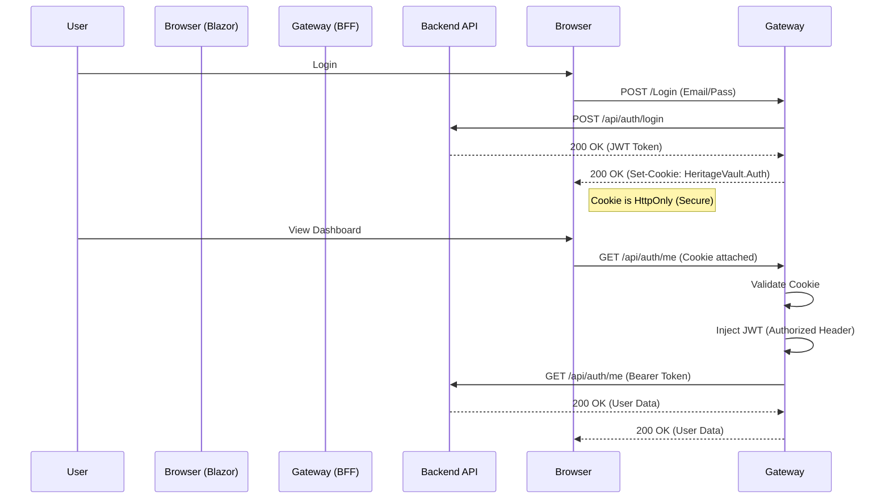

# DigitalVault BFF (Backend-for-Frontend) Gateway Documentation

## Overview

The `DigitalVault.Gateway` project serves as a **Backend-for-Frontend (BFF)**. It acts as a secure intermediary between the **Blazor WebAssembly Client** and the **Backend API**.

### Why do we need a BFF?
1.  **Security**: Storing JWT Tokens in the browser (LocalStorage) is insecure (vulnerable to XSS). The BFF stores tokens securely on the server and issues **HttpOnly Cookies** to the browser.
2.  **Simplified Client**: The Blazor client doesn't need to handle JWT refreshment or secret management. It just makes requests, and the browser handles cookies automatically.
3.  **Reverse Proxy**: All API requests go through the same domain (e.g., `https://vault.com/api/...`), avoiding complex CORS configuration issues.

## Architecture



## Key Components

### 1. Reverse Proxy (YARP)
Used to forward requests from the Gateway to the Backend API or the Blazor Client host.
- **Config**: `appsettings.json` -> `ReverseProxy` section.
- **Critical Setting**: `Transforms` must preserve the `/api` prefix.
  ```json
  "Transforms": [ { "PathPattern": "/api/{**catch-all}" } ]
  ```

### 2. JWT Injection Middleware
Located at `Middleware/JwtInjectionMiddleware.cs`.
- **Role**: Intercepts authorized requests to `/api/*`, reads the User's identity from the Cookie, generates a **new JWT Token**, and injects it into the `Authorization` header before forwarding to the Backend API.
- **Critical Requirement**: The JWT generated here **MUST** be trusted by the Backend API. This means `SecretKey`, `Issuer`, and `Audience` must match.

### 3. Login Page (Razor Page)
Located at `Pages/Login.cshtml`.
- Handles the actual login form.
- calls `HttpContext.SignInAsync` to create the auth cookie.
- **Important**: Must include `ClaimTypes.Name` in the claims list so the middleware can generate a valid JWT.

---

## Production Deployment Checklist 🚀

When moving from Development (Localhost) to Production, verify these critical items:

### 1. 🔐 JWT Configuration (CRITICAL)
The **Gateway** and **Backend API** must see each other as trusted parties.
*   [ ] **SecretKey**: Must be **IDENTICAL** in both `DigitalVault.Gateway/appsettings.json` and `DigitalVault.API/appsettings.json`.
    *   *Config*: `JwtSettings:SecretKey`
    *   *Risk*: If not matching, API returns 401 Unauthorized.
*   [ ] **Issuer/Audience**: Must match what the API expects.
    *   *Gateway Config*: `Issuer="DigitalVault"`, `Audience="DigitalVault.Client"`
    *   *API Config*: Same values.

### 2. 🛡️ HTTPS Enforcement
In production, security must be strict.
*   [ ] **API**: Uncomment or enable `app.UseHttpsRedirection()` in `DigitalVault.API/Program.cs` (it was disabled for local dev).
*   [ ] **Cookies**: Ensure `CookiePolicy` in Gateway sets `Secure=Policy.Always`.
    *   *Config*: `Program.cs` -> `options.Cookie.SecurePolicy`.

### 3. 🔑 Key Persistence (Data Protection)
To prevent users from being logged out every time the Gateway restarts:
*   [ ] **Persist Keys**: Ensure Data Protection keys are stored in a persistent location (e.g., dedicated folder on server, Redis, or Azure KeyVault), not just a temporary container folder.
    *   *Current*: `PersistKeysToFileSystem(new DirectoryInfo(...))`

### 4. 🌐 URLs and Ports
*   [ ] **ApiBaseUrl**: Update `ApiBaseUrl` in Gateway `appsettings.json` to point to the **Private IP/Internal URL** of the Backend API (not localhost).
*   [ ] **Destination Address**: Update YARP `Destinations` in `appsettings.json` to point to the production API address.

### 5. 🍪 Cookie Security
*   [ ] **SameSite**: Should be `Strict` or `Lax`.
*   [ ] **Domain**: If API and Gateway are on different subdomains, ensure Cookie Domain is set correctly (though BFF usually solves this by being on the same domain).

## Troubleshooting Common Issues

| Symptom | Probable Cause | Fix |
|---------|---------------|-----|
| **401 Unauthorized** | JWT Secret/Issuer mismatch | Check `appsettings.json` in both projects. |
| **404 Not Found** | Proxy stripping URL | Check YARP `Transforms` in Gateway config. |
| **Looping Redirect** | HTTP vs HTTPS conflict | Check API `UseHttpsRedirection` or Gateway Forwarding defaults. |
| **Empty Token Log** | Missing Claims | Check `Login.cshtml.cs` includes `ClaimTypes.Name`. |
